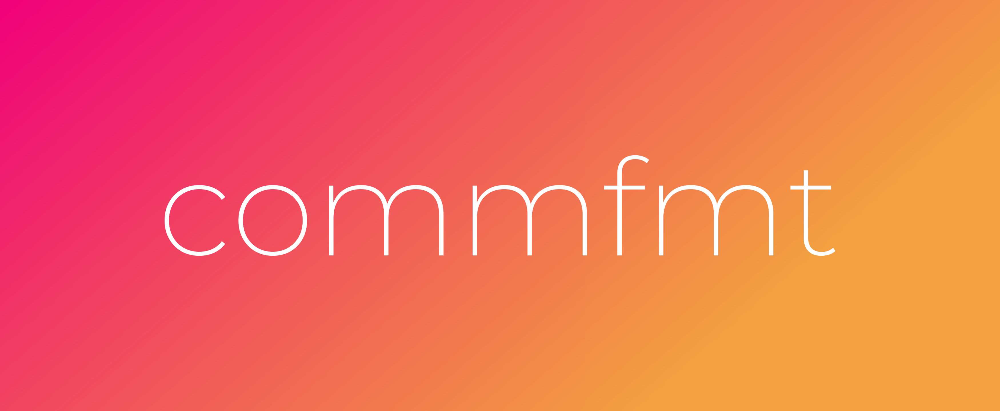

# 

[](https://travis-ci.org/codingconcepts/commfmt)

A standard for Go comments.

## Installation

```
$ go get -u github.com/codingconcepts/commfmt
```

## Usage

```
$ commfmt -h
Usage of commfmt:
  -p string
        the relative/absolute path of the root directory. (default ".")
  -w int
        the maximum width of comments. (default 80)
```

## Example

Here's an example of running the commfmt tool against a directory containing the following code block:

```
$ commfmt -p . -w 40
```

**Before**:

``` go
// Aaa aaa aaa aaa aaa aaa aaa aaa aaa aaa aaa aaa aaa aaa aaa aaa.
//
//     if err != nil {
//             return err
//     }
//
// Bbb bbb bbb bbb bbb bbb bbb bbb bbb bbb bbb bbb bbb bbb bbb bbb.
```

**After**:

``` go
// Aaa  aaa aaa aaa aaa aaa aaa aaa aaa aaa
// aaa aaa aaa aaa aaa aaa.
// 
//     if err != nil {
//             return err
//     }
// 
// Bbb  bbb bbb bbb bbb bbb bbb bbb bbb bbb
// bbb bbb bbb bbb bbb bbb.
```

## Todos

* FIXME: Additional commented line when last paragraph is a code block.
* FIXME: Comments should align to their original column position (currently moving to 0):

**Before**
``` go
func one() {
	// Ccc ccc ccc ccc ccc ccc ccc ccc ccc ccc ccc ccc ccc ccc ccc ccc.
	fmt.Println("Hello, World!")
}
```

**After**
``` go
func one() {
	// Ccc  ccc ccc ccc ccc ccc ccc ccc ccc ccc
// ccc ccc ccc ccc ccc ccc.
	fmt.Println("Hello, World!")
}
```

* Consider /**/ code blocks.